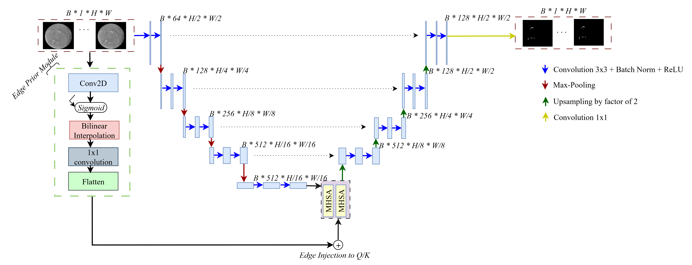

# EdgeAttNet: Towards Barb-Aware Filament Segmentation

Note: This *README* file is for demonstration purposes. For details of the model, please refer to our [paper on arXiv](https://arxiv.org/abs/2509.02964).  
All code files are licensed under the MIT license (see `LICENSE`).


---

[**Paper**](https://arxiv.org/pdf/2509.02964) | [**Dataset (MAGFILO)**](#) 



Solar filaments are elongated dark structures observed in Hα images, carrying crucial information about solar magnetic fields and space weather events. Detecting them reliably remains challenging due to their fine-scale morphology and imaging artifacts.

We present **EdgeAttNet** — a **U-Net**-based segmentation architecture enhanced with **Edge-Guided Multihead Self-Attention (EG-MHSA)** — designed to accurately segment solar filaments while preserving subtle morphological features such as filament barbs, which are essential for determining the magnetic field orientation of coronal mass ejections (CMEs). By integrating learned edge priors into the attention mechanism, EdgeAttNet outperforms conventional architectures in capturing both global context and fine-grained details, while also reducing the number of trainable parameters compared to U-Net and U-Net+MHSA (with or without positional encodings).


Any questions regarding the model or dataset can be directed to Victor Solomon  (vsolomon3@studentgsu.edu).

## Updates Log
2025.08.12 &emsp; Initial release of EdgeAttNet model and codebase.

## Overview
- **Edge Guided MHSA**: A novel attention mechanism that integrates edge priors into self-attention for better feature extraction.
- **Parameter Efficiency**: Fewer parameters than standard U-Net and MHSA-based models, with faster training and inference.
- **High-resolution Filament Segmentation**: Optimized for capturing detailed filament morphology, enabling downstream analysis such as chirality classification and magnetic field interpretation.

## Methodology

1. **Model Architecture**  
   Built upon the U-Net backbone, EdgeAttNet introduces the **EG-MHSA** module, which leverages edge priors to enhance spatial awareness without explicit positional encodings.

2. **Preprocessing Pipeline**  
   Includes corrections for limb darkening and background interference, ensuring robust performance across diverse solar observations.

3. **Training & Evaluation**  
   Trained and evaluated on the **MAGFILO** dataset, outperforming baseline models including:
   - Standard U-Net
   - U-Net + MHSA (with and without positional encodings)

## Results

**EdgeAttNet** achieves superior segmentation performance while significantly reducing model complexity:

### Model Complexity

| Model                          | Trainable Parameters |
|--------------------------------|----------------------|
| U-Net                          | 31,030,593           |
| U-Net + MHSA (no PE)           | 35,231,041           |
| U-Net + MHSA (with PE)         | 35,362,113           |
| **EdgeAttNet (ours)**          | **22,658,891**       |

This reduction in complexity results in improved training and inference efficiency, as well as better generalization.

Additionally, the integration of edge priors removes the need for positional encodings, simplifying the architecture while maintaining robust spatial feature extraction.

### Segmentation Performance on MAGFILO Test Split

| Metric                        | U-Net   | U-Net + MHSA (no PE) | U-Net + MHSA (with PE) | **EdgeAttNet (ours)** |
|------------------------------|---------|------------------------|--------------------------|------------------------|
| *mIoU*<sub>pairwise</sub>    | 0.5724  | 0.5856                 | 0.6200                   | **0.6451**             |
| *mIoU*<sub>multiscale</sub>  | 0.5848  | 0.6000                 | 0.6601                   | **0.7032**             |

**EdgeAttNet** consistently outperforms all U-Net variants across both pairwise and multiscale *mIoU* metrics, demonstrating its effectiveness in capturing both global context and fine-scale spatial features.


## Downstream Applications

- **Solar Filament Segmentation** in Hα images
- **Chirality Classification** for magnetic field interpretation
- Potential use in **solar eruption forecasting** and **space weather analysis**

## Code Base and Dependencies

All code is written in Python (>=3.8). Deep learning models are implemented in PyTorch and trained on GPU clusters.

| File | Description |
|------|-------------|
| `model/edgeattnet_model.py` | Implementation of the EdgeAttNet architecture & training. |
| `data_loader.py` | Data loading and preprocessing utilities.|
| `main.py` | Contains main function to run model.|
| `requirements.txt` | Required dependencies. |


## References

<a id="1">[1]</a> S. E. Gibson, “Solar prominences: theory and models: Fleshing out the magnetic skeleton,” *Living Reviews in Solar Physics*, vol. 15, no. 1, p. 7, 2018.  

<a id="2">[2]</a> J. Eastwood, R. Nakamura, L. Turc, L. Mejnertsen, and M. Hesse, “The scientific foundations of forecasting magnetospheric space weather,” *Space Science Reviews*, vol. 212, pp. 1221–1252, 2017.  

<a id="3">[3]</a> S. F. Martin, “Conditions for the formation and maintenance of filaments (invited review),” *Solar Physics*, vol. 182, no. 1, pp. 107–137, 1998.  

<a id="4">[4]</a> ——, “Filament chirality: A link between fine-scale and global patterns,” in *International Astronomical Union Colloquium*, vol. 167. Cambridge University Press, 1998, pp. 419–429.  

<a id="5">[5]</a> Q. Hao, Y. Guo, C. Fang, P.-F. Chen, and W.-D. Cao, “Can we determine the filament chirality by the filament footpoint location or the barb bearing?” *Research in Astronomy and Astrophysics*, vol. 16, no. 1, p. 001, 2016.  

<a id="6">[6]</a> A. Ahmadzadeh, S. S. Mahajan, D. J. Kempton, R. A. Angryk, and S. Ji, “Toward filament segmentation using deep neural networks,” in *IEEE Big Data*, 2019, pp. 4932–4941.  

<a id="7">[7]</a> G. Zhu, G. Lin, X. Yang, and C. Zeng, “Flat U-Net: An efficient ultralightweight model for solar filament segmentation in full-disk H-alpha images,” *arXiv preprint arXiv:2502.07259*, 2025.  

<a id="8">[8]</a> O. Ronneberger, P. Fischer, and T. Brox, “U-Net: Convolutional networks for biomedical image segmentation,” in *MICCAI*, 2015, pp. 234–241.  

<a id="9">[9]</a> O. Petit, N. Thome, C. Rambour, L. Themyr, T. Collins, and L. Soler, “U-Net Transformer: Self and cross attention for medical image segmentation,” in *MLMI Workshop, MICCAI*, 2021, pp. 267–276.  

<a id="10">[10]</a> X. Qin, C. Wu, H. Chang, H. Lu, and X. Zhang, “Match Feature U-Net: Dynamic receptive field networks for biomedical image segmentation,” *Symmetry*, vol. 12, no. 8, p. 1230, 2020.  

<a id="11">[11]</a> O. Oktay et al., “Attention U-Net: Learning where to look for the pancreas,” in *MICCAI*, Springer, 2018.  

<a id="12">[12]</a> E. Xie, W. Wang, Z. Yu, A. Anandkumar, J. M. Alvarez, and P. Luo, “SegFormer: Simple and efficient design for semantic segmentation with transformers,” *NeurIPS*, vol. 34, pp. 12077–12090, 2021.  

<a id="13">[13]</a> S. Woo, J. Park, J.-Y. Lee, and I. S. Kweon, “CBAM: Convolutional block attention module,” in *ECCV*, Springer, 2018.  

<a id="14">[14]</a> J. Hu, L. Shen, and G. Sun, “Squeeze-and-excitation networks,” in *CVPR*, 2018, pp. 7132–7141.  

<a id="15">[15]</a> A. G. Roy, N. Navab, and C. Wachinger, “Concurrent spatial and channel squeeze & excitation in fully convolutional networks,” in *MICCAI*, Springer, 2018, pp. 421–429.  

<a id="16">[16]</a> T. Ge, S.-Q. Chen, and F. Wei, “EdgeFormer: A parameter-efficient transformer for on-device seq2seq generation,” *arXiv preprint arXiv:2202.07959*, 2022.  

<a id="17">[17]</a> A. Ahmadzadeh et al., “A dataset of manually annotated filaments from H-alpha observations,” *Scientific Data*, vol. 11, no. 1, p. 1031, 2024.  

<a id="18">[18]</a> J. Harvey et al., “The Global Oscillation Network Group (GONG) project,” *Science*, vol. 272, no. 5266, pp. 1284–1286, 1996.  

<a id="19">[19]</a> D. Wang and Y. Shang, “A new active labeling method for deep learning,” in *IJCNN*, IEEE, 2014, pp. 112–119.  

<a id="20">[20]</a> A. Men’shchikov, “Background derivation and image flattening: getimages,” *Astronomy & Astrophysics*, vol. 607, p. A64, 2017.  

<a id="21">[21]</a> A. M. Wink and J. B. Roerdink, “Denoising functional MR images: A comparison of wavelet denoising and Gaussian smoothing,” *IEEE Transactions on Medical Imaging*, vol. 23, no. 3, pp. 374–387, 2004.  

<a id="22">[22]</a> A. M. Reza, “Realization of the contrast limited adaptive histogram equalization (CLAHE) for real-time image enhancement,” *Journal of VLSI Signal Processing Systems*, vol. 38, no. 1, pp. 35–44, 2004.  

<a id="23">[23]</a> R. O. Duda and P. E. Hart, “Use of the Hough transformation to detect lines and curves in pictures,” *Communications of the ACM*, vol. 15, no. 1, pp. 11–15, 1972.  

<a id="24">[24]</a> X. Guo et al., “Solar-filament detection and classification based on deep learning,” *Solar Physics*, vol. 297, no. 8, p. 104, 2022.  

<a id="25">[25]</a> A. Diercke et al., “A universal method for solar filament detection from Hα observations using semi-supervised deep learning,” *Astronomy & Astrophysics*, vol. 686, p. A213, 2024.  

<a id="26">[26]</a> H. Ji et al., “A systematic magnetic polarity inversion line dataset from SDO/HMI magnetograms,” *The Astrophysical Journal Supplement Series*, vol. 265, no. 2, p. 40, 2023.  

<a id="27">[27]</a> T.-Y. Lin et al., “Microsoft COCO: Common objects in context,” in *ECCV*, Springer, 2014, pp. 740–755.  

<a id="28">[28]</a> H. Rezatofighi et al., “Generalized intersection over union: A metric and a loss for bounding box regression,” in *CVPR*, 2019, pp. 658–666.  

<a id="29">[29]</a> A. Ahmadzadeh, D. J. Kempton, Y. Chen, and R. A. Angryk, “Multiscale IoU: A metric for evaluation of salient object detection with fine structures,” in *IEEE ICIP*, 2021, pp. 684–688.  


## To install dependencies:

```bash
pip install -r requirements.txt
