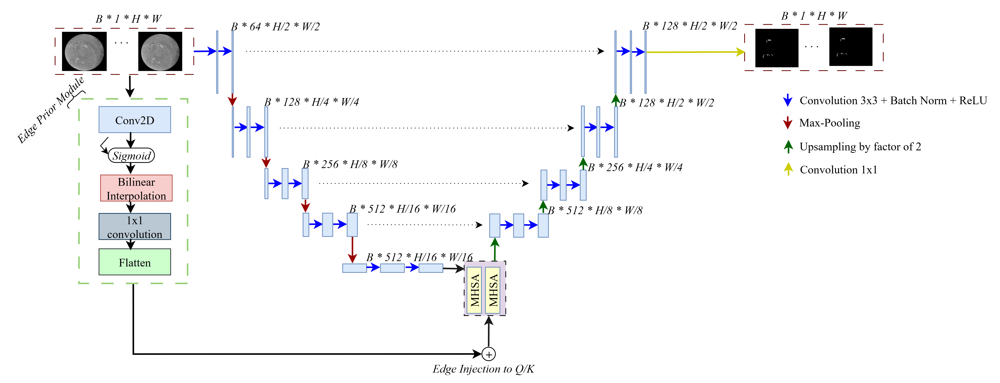

# EdgeAttNet: Towards Barb-Aware Filament Segmentation

Note: This *README* file is for demonstration purposes. For details of the model, please refer to our [paper on arXiv](https://arxiv.org/abs/2509.02964).  
All code files are licensed under the MIT license (see `LICENSE`).


---

[**Paper (coming soon)**]() | [**Dataset (MAGFILO)**](#) | [**Pre-trained Models (coming soon)**]()


Solar filaments are elongated dark structures observed in Hα images, carrying crucial information about solar magnetic fields and space weather events. Detecting them reliably remains challenging due to their fine-scale morphology and imaging artifacts.

Here, we present **EdgeAttNet** — a **U-Net**-based segmentation architecture enhanced with **Edge Guided Multihead Self Attention (EG-MHSA)**, designed to accurately segment solar filaments while preserving subtle morphological features such as filament barbs which is essential for determing the magnetic field orientation of coronal mass ejections (CMEs). By integrating learned edge priors into the attention mechanism, EdgeAttNet outperforms conventional architectures in capturing both global context and fine-scale details whilst minimizing the number of trainabe parameters as compared to U-Net and UNet+MHSA (with or without positioial encodings).

Any questions regarding the model or dataset can be directed to [Your Name] (vsolomon3@studentgsu.edu).

## Updates Log
2025.09.03 &emsp; Initial release of EdgeAttNet model and codebase.

## Overview
- **Edge Guided MHSA**: A novel attention mechanism that integrates edge priors into self-attention for better feature extraction.
- **Parameter Efficiency**: Fewer parameters than standard U-Net and MHSA-based models, with faster training and inference.
- **High-resolution Filament Segmentation**: Optimized for capturing detailed filament morphology, enabling downstream analysis such as chirality classification and magnetic field interpretation.

## Methodology

1. **Model Architecture**  
   Built upon the U-Net backbone, EdgeAttNet introduces the **EG-MHSA** module, which leverages edge priors to enhance spatial awareness without explicit positional encodings.

2. **Preprocessing Pipeline**  
   Includes corrections for limb darkening and background interference, ensuring robust performance across diverse solar observations.

3. **Training & Evaluation**  
   Trained and evaluated on the **MAGFILO** dataset, outperforming baseline models including:
   - Standard U-Net
   - U-Net + MHSA (with and without positional encodings)

## Results

EdgeAttNet achieves superior segmentation performance while reducing model complexity:

| Model                           | Trainable Parameters |
|--------------------------------|----------------------|
| U-Net                           | 31,030,593           |
| U-Net + MHSA (no PE)            | 35,231,041           |
| U-Net + MHSA (with PE)          | 35,362,113           |
| **EdgeAttNet (ours)**           | **22,658,891**       |

This reduction in complexity results in improved training and inference efficiency, as well as better generalization.

Additionally, the integration of edge priors removes the need for positional encodings, simplifying the architecture while maintaining robust spatial feature extraction.

## Applications

- **Solar Filament Segmentation** in Hα images
- **Chirality Classification** for magnetic field interpretation
- Potential use in **solar eruption forecasting** and **space weather analysis**

## Code Base and Dependencies

All code is written in Python (>=3.8). Deep learning models are implemented in PyTorch and trained on GPU clusters.

| File | Description |
|------|-------------|
| `models/edgeattnet.py` | Implementation of the EdgeAttNet architecture. |
| `train.py` | Training script for model training and evaluation. |
| `data_loader.py` | Data loading and preprocessing utilities. |
| `requirements.txt` | Required dependencies. |


## References
<a id="1">[1]</a> S. E. Gibson, “Solar prominences: theory and models: Fleshing out the magnetic skeleton,” Living reviews in solar physics, vol. 15, no. 1, p. 7, 2018.

<a id="2">[2]</a> J. Eastwood, R. Nakamura, L. Turc, L. Mejnertsen, and M. Hesse, “The scientific foundations of forecasting magnetospheric space weather,” Space Science Reviews, vol. 212, pp. 1221–1252, 2017.

<a id="3">[3]</a> S. F. Martin, “Conditions for the formation and maintenance of filaments–(invited review),” Solar Physics, vol. 182, no. 1, pp. 107–137, 1998.

<a id="4">[4]</a> ——, “Filament chirality: A link between fine-scale and global patterns,” in International Astronomical Union Colloquium, vol. 167. Cambridge University Press, 1998, pp. 419–429.

<a id="5">[5]</a> Q. Hao, Y. Guo, C. Fang, P.-F. Chen, and W.-D. Cao, “Can we determine the filament chirality by the filament footpoint location or the barb bearing?” Research in Astronomy and Astrophysics, vol. 16, no. 1, p. 001, 2016.

...

<a id="29">[29]</a> A. Ahmadzadeh, D. J. Kempton, Y. Chen, and R. A. Angryk, “Multiscale iou: A metric for evaluation of salient object detection with fine structures,” in 2021 IEEE International Conference on Image Processing (ICIP). IEEE, 2021, pp. 684–688.

## To install dependencies:

```bash
pip install -r requirements.txt
